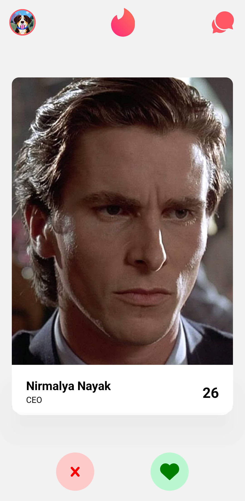
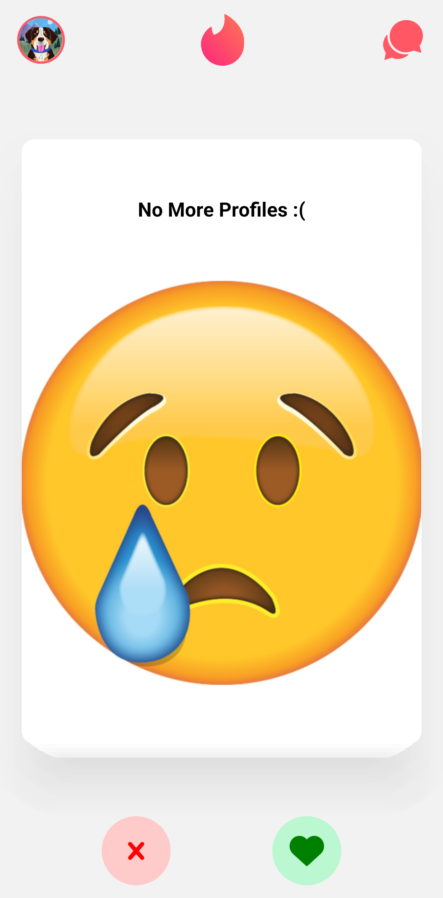
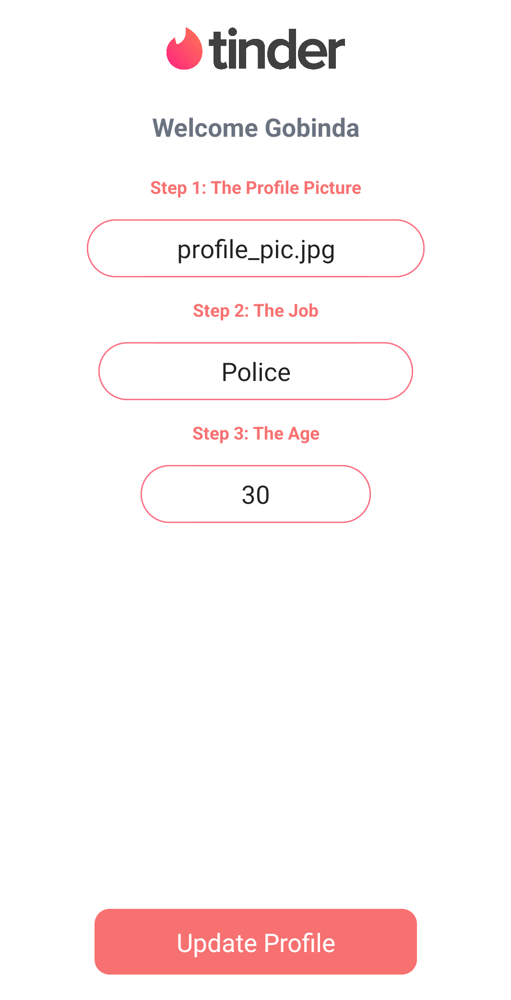
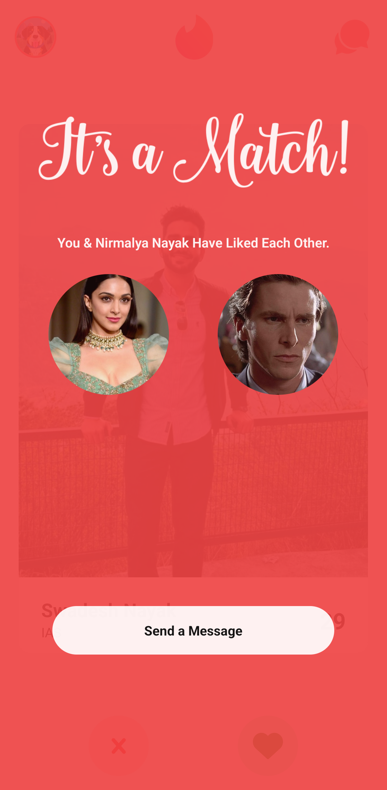
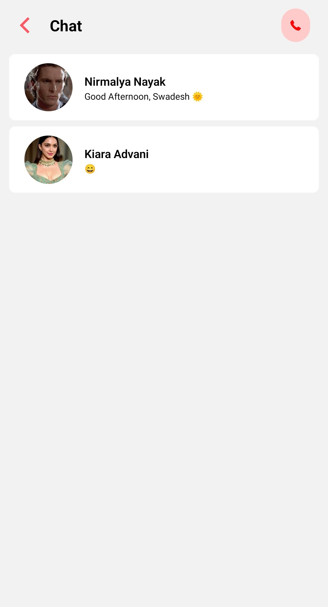
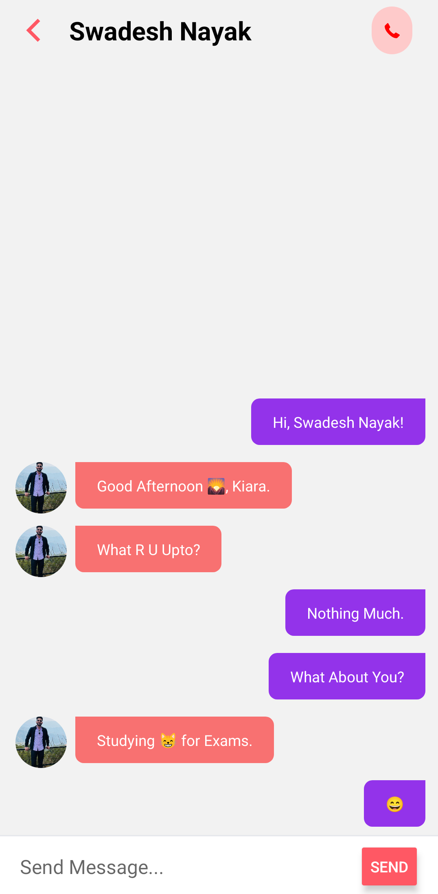

# Tinder Clone (Expo)

This is a repository for Tinder Clone with React Native, Expo, TypeScript, TailWindCSS, Context API, Google Firebase, React Navigation.

Funcionalities:

- Log In / Sign Up with Firebase Google OAuth.
- Swipe Left/Right on Profiles to Pass/Match.
- Add or Edit User Details.
- Chat with Matched Users.
- In-App Screen Navigation with Gesture.
- Modern / Responsive Layout.

### Prerequisites

**Node ^= 16**

**Expo Go (from Mobile AppStore)**

**Android Studio / XCode (Virtual Device Simulation)**

**VS Code (IDE)**

**EAS_CLI (To Build Application)**

### Cloning the repository

```shell
git clone https://github.com/nayak-nirmalya/tinder-clone.git
```

## Running Project

To run your project, navigate to the root directory and run one of the following npm commands:

```shell
cd uber-clone
npm run android
npm run ios # you need to use macOS to build the iOS project - use the Expo app if you need to do iOS development without a Mac
npm expo start
```

If You Face Any Issue Run:

```shell
expo start -c
```

to Clear Expo Build Cache.

This Expo Project Has Native dependencies, so to run you have to build first:

```shell
eas build --profile development --platform android
```

🤖 Open this link on your Android devices (or scan the QR code) to install the app:
https://expo.dev/accounts/nirmalya_nayak/projects/tinder/builds/865c6309-244e-423a-83fe-7741aa96df14

## Screenshots

<div align='center'>

### LogIn Screen


### Home Screen



### No More Profile



### User SetUp Modal



### Match Screen



### Chat List Screen



### Message Screen



</div>
